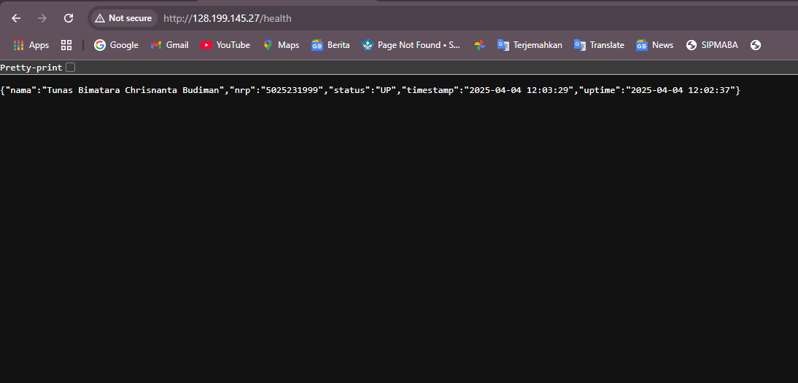
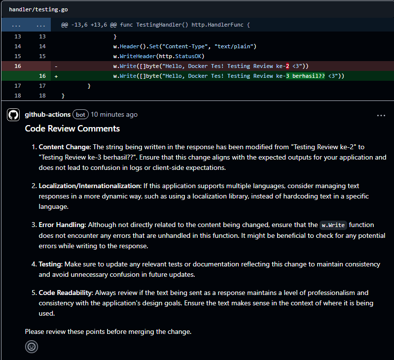

| Nama                      |    NRP     |
| ------------------------- | :--------: |
| Hamasah Fatiy Dakhilullah | 5025231139 |

# Penugasan Modul 1 Open Recruitment NETICS 2025

## Tujuan

Membuat sebuah API publik dengan endpoint `/health` dengan menerapkan konsep CI/CD menggunakan GitHub Actions.

## Link

- Published Docker Image <br/>
  [Docker Image](https://hub.docker.com/r/hamasfa/health/tags)

- Deployed API <br/>
  [URL API](http://128.199.145.27/health)

## Struktur Direktori

```
.
│   Dockerfile
│   go.mod
│   go.sum
│   main.go
│   Readme.md
│
├───.github
│   └───workflows
│           docker-image.yml
|           code-review.yml
│
├───handler
│       health.go
│       index.go
│
└───response
        health_response.go
```

## Penjelasan Kode

- .github/workflows/docker-image.yml

```
name: Docker Image CI

on:
  push:
    branches: ["main"]
    tags:
      - "v*.*.*"

jobs:
  build-and-test:
    runs-on: ubuntu-latest
    steps:
      - name: Checkout the repository
        uses: actions/checkout@v4

      - name: Cache
        uses: actions/cache@v4
        with:
          path: |
            ~/.cache/go-build
            ~/go/pkg/mod
          key: ${{ runner.os }}-go-${{ hashFiles('**/go.sum') }}
          restore-keys: |
            ${{ runner.os }}-go-

      - name: Setup Go
        uses: actions/setup-go@v5
        with:
          go-version: "1.23.2"

      - name: Download modules
        run: go mod download

      - name: Build Go
        run: go build -o api main.go

      - name: Test Go
        run: go test -v ./...

  docker:
    runs-on: ubuntu-latest
    needs: build-and-test
    outputs:
      version: ${{ steps.meta.outputs.version }}
    steps:
      - name: Checkout the repository
        uses: actions/checkout@v4
        with:
          fetch-depth: 0

      - name: Docker Meta
        id: meta
        uses: docker/metadata-action@v5
        with:
          images: ${{ secrets.DOCKERHUB_USERNAME }}/health
          tags: |
            type=semver,pattern={{version}}
            type=raw,value=latest,enable=${{ github.ref == 'refs/heads/main' }}

      - name: Set up QEMU
        uses: docker/setup-qemu-action@v3

      - name: Set up Docker Buildx
        uses: docker/setup-buildx-action@v3

      - name: Login to Docker Hub
        uses: docker/login-action@v3
        with:
          username: ${{ secrets.DOCKERHUB_USERNAME }}
          password: ${{ secrets.DOCKERHUB_TOKEN }}

      - name: Build and push
        uses: docker/build-push-action@v5
        with:
          push: true
          tags: ${{ steps.meta.outputs.tags }}
          labels: ${{ steps.meta.outputs.labels }}
          cache-from: type=gha
          cache-to: type=gha,mode=max

  deploy:
    runs-on: ubuntu-latest
    needs: docker
    steps:
      - name: Version
        id: version
        run: |
          if [[ "${{ github.ref }}" == "refs/heads/main" ]]; then
            VERSION=latest
            echo "VERSION=latest" >> $GITHUB_OUTPUT
            echo "VERSION-latest"
          else
            VERSION=${GITHUB_REF#refs/tags/v}
            echo "VERSION=$VERSION" >> $GITHUB_OUTPUT
            echo "VERSION=$VERSION"
          fi

      - name: Deploy
        uses: appleboy/ssh-action@master
        with:
          host: ${{ secrets.HOST }}
          username: ${{ secrets.USERNAME }}
          key: ${{ secrets.SSH_KEY }}
          script: |
            docker pull ${{ secrets.DOCKERHUB_USERNAME }}/health:${{ steps.version.outputs.VERSION }}
            docker stop health || echo "Gak ada yang bisa distop"
            docker rm health || echo "Gak ada yang bisa dihapus"
            docker run -d --name health -p 80:8080 ${{ secrets.DOCKERHUB_USERNAME }}/health:${{ steps.version.outputs.VERSION }}
            docker image prune -f
```

Pada workflow ini terbagi menjadi 3 job, yaitu :

1. **build-and-test** <br/>
   Job ini melakukan tugas sebagai berikut :

   - Melakukan checkout untuk mengambil kode dari repositori.
   - Menyimpan module-module yang digunakan untuk mempercepat build selanjutnya.
   - Menyiapkan environment Go dengan versi 1.23.2.
   - Mendownload modules yang dibutuhkan.
   - Melakukan compile dan testing.

2. **docker** <br/>
   Job ini melakukan tugas sebagai berikut :

   - Memastikan keberadaan Dockerfile untuk menghindari error saat build.
   - Menyiapkan QEMU dan Docker Buildx untuk build multi-arsitektur.
   - Melakukan login ke Docker Hub.
   - Melakukan build dan push image terbaru ke Docker Hub.
   - Membuat tag versi berdasarkan Git tags.
   - Menggunakan cache dari GitHub Actions untuk mempercepat build.

3. **deploy** <br/>
   Job ini melakukan tugas sebagai berikut :

   - Mengambil versi yang dibutuhkan sesuai kondisi
   - Melakukan SSH ke VPS.
   - Menjalankan script dengan tujuan:
     1. Menarik (pull) Docker image `health` terbaru dari sumber yang telah diatur.
     2. Memberhentikan container lama `health`, jika ada.
     3. Menghapus container lama `health`, jika ada.
     4. Menjalankan container baru dengan port `80:8080`.
     5. Menghapus image lama yang tidak terpakai untuk menghemat penyimpanan.

- code-review.yml

```
name: Code Review

permissions:
  contents: read
  pull-requests: write

on:
  pull_request:
    types: [opened, reopened, synchronize]

jobs:
  test:
    runs-on: ubuntu-latest
    steps:
      - name: Run Code Review
        uses: anc95/ChatGPT-CodeReview@main
        env:
          GITHUB_TOKEN: ${{ secrets.GITHUB_TOKEN }}
          OPENAI_API_KEY: ${{ secrets.OPENAI_API_KEY }}
          MODEL: gpt-4o-mini
```

Pada workflow ini, code-review.yml menjalankan proses peninjauan kode secara otomatis menggunakan anc95/ChatGPT-CodeReview dengan model gpt-4o-mini untuk mempermudah proses review.

- Dockerfile

```
FROM golang:1.23.2-alpine AS builder
WORKDIR /app
COPY go.mod go.sum ./
RUN go mod download
COPY . .
RUN go build -o server main.go

FROM alpine:latest
WORKDIR /root/
COPY --from=builder /app/server .
EXPOSE 8080
CMD ["./server"]
```

Terdapat dua fase, yaitu :

1. Fase 1 (Builder) <br/>
   Fase ini melakukan tugas sebagai berikut :
   - Menggunakan image golang:1.23.2-alpine sebagai env
   - Menyalin go.mod dan go.sum, lalu mendownload modules yang diperlukan
   - Menyalin semua yang ada di dalam workspace dan melakukan compile
2. Fase 2 (Runtime) <br/>
   Fase ini melakukan tugas sebagai berikut :
   - Menggunakan image alpine:latest sebagai base image agar memiliki ukuran yang kecil
   - Menyalin hasil compile dari fase builder
   - Membuka port 8080
   - Menjalankan server

- response/health_response.go

```
package response

type HealthResponse struct {
	Nama      string `json:"nama"`
	NRP       string `json:"nrp"`
	Status    string `json:"status"`
	TimeStamp string `json:"timestamp"`
	Uptime    string `json:"uptime"`
}
```

Kode di atas adalah sebuah struktur data yang nantinya akan dijadikan format respons dalam bentuk JSON.

- handler/index.go

```
package handler

import (
	"net/http"
)

func IndexHandler() http.HandlerFunc {
	return func(w http.ResponseWriter, r *http.Request) {
		if r.Method != http.MethodGet {
			w.WriteHeader(http.StatusMethodNotAllowed)
			w.Write([]byte("Method not allowed"))
			return
		}
		w.Header().Set("Content-Type", "text/plain")
		w.WriteHeader(http.StatusOK)
		w.Write([]byte("Hello, Docker Tes! <3"))
	}
}
```

Kode di atas adalah handler untuk endpoint “/” yang hanya menerima request dengan metode GET. Apabila request tersebut valid, maka akan membalas dengan respons bertuliskan "Hello, Docker Tes! <3".

- handler/health.go

```
package handler

import (
	"encoding/json"
	"learn-ci-cd/response"
	"net/http"
	"time"
)

func HealthHandler(timeUp string, timeZone *time.Location) http.HandlerFunc {
	return func(w http.ResponseWriter, r *http.Request) {
		if r.Method != http.MethodGet {
			w.WriteHeader(http.StatusMethodNotAllowed)
			w.Write([]byte("Method not allowed"))
			return
		}

		currentTime := time.Now().In(timeZone).Format("2006-01-02 15:04:05")

		response := response.HealthResponse{
			Nama:      "Tunas Bimatara Chrisnanta Budiman",
			NRP:       "5025231999",
			Status:    "UP",
			TimeStamp: currentTime,
			Uptime:    timeUp,
		}

		w.Header().Set("Content-Type", "application/json")
		w.WriteHeader(http.StatusOK)
		json.NewEncoder(w).Encode(response)
	}
}
```

Kode di atas adalah handler untuk endpoint “/health” yang hanya menerima request dengan metode GET. Apabila request tersebut valid, maka akan membalas dengan respons JSON yang yang diambil dari struct HealthResponse yang berisi informasi, seperti nama, NRP, status, timestamp, dan uptime.

## Lampiran

- Main Task
  

- Code Review
  
